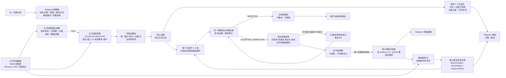

# 系统架构

核心边界：

- 过滤器只决定哪些币值得深查，不决定多空。
- Bybit 是价格与结构主口径；其他公开来源只作旁证，不平均参考价。
- 模型是方向和监测阈值语义的唯一判断者。宿主只负责采集、调度、Schema、可执行性、一次性消费、版本与通知。
- 大致止盈位只展示，不参与方向、择优、freshness、阈值或失效。
- 阈值 crossing 只表示“需要模型重新介入”，不自动表示方向失效；微观数据不能脱离反向完成价格结构单独唤醒。
- `hysteresis` 只用于触发后的安全侧重新武装，不改变首次 crossing 的阈值。模型复核与正式激活之间无论完成柱基线向哪侧移动，只要固定结构阈值仍未满足，宿主都会机械更新 `current_value` 而不改 threshold；只有交付前已经穿越或规则变得不可执行时才只重采/重审该币。
- 模型明确 `REJECTED` 代表当前没有高质量阈值，是正常零规则结果，不重试、不报错。只有规则在交付激活前已经越线/不可执行时才只重采、重审该币最多 3 次；重审无规则仍正常结束，真正技术错误耗尽后才产生一次带原因、诊断和人工重试按钮的通知。
- 一条组合规则触发时，事件和 Telegram 同时记录 primary、连续完成柱计数及全部 confirmation；通知不得只展示 primary 而隐藏实际执行条件。
- 每个 `(analysis_id, symbol)` 是一次性规则版本。首个完整命中先持久化并退役整组旧规则，再通知、重采、复核；失败不会复活旧规则。
- 旧规则持续到 `:00/:30` 定时任务真正开始，再原子停用，避免最后 5 分钟盲区；已经接受的紧急复核继续，定时流程不等待。最新定时分析始终具有版本权威性，迟到的紧急/人工重试不能覆盖它。
- 主信号与监测配置相互独立：两个方向信号合格后先保存并通知；本轮没有阈值只影响该币自动唤醒能力，不删除信号，也不属于流程失败。
- 系统没有账户、仓位、保证金、杠杆、订单、盈亏或自动交易平面。

失败链路同样是业务流程：通知会明确哪一个工作流、哪一步、此前完成了什么、直接原因、实际影响和解决方法。按钮只重跑失败组件；重试在后台执行、原子认领、可跨重启恢复，旧版本已被新分析替代时安全停止。
