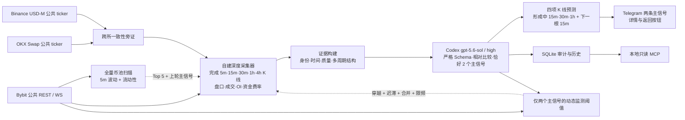

# 系统架构

```mermaid
flowchart LR
    BY["Bybit 公共 REST / WS"] --> SCAN["全量币池扫描\n5m 波动 + 流动性"]
    BY --> COL["自建深度采集器\n完成 5m·15m·30m·1h·4h K 线\n盘口·成交·OI·资金费率"]
    BN["Binance USD-M 公共 ticker"] --> REF["跨所一致性旁证"]
    OK["OKX Swap 公共 ticker"] --> REF
    REF --> COL
    SCAN -. "Top 5 + 上轮主信号" .-> COL
    COL --> EVI["证据构建\n身份·时间·质量·多周期结构"]
    EVI --> AI["Codex gpt-5.6-sol / high\n严格 Schema·相对比较·恰好 2 个主信号"]
    AI --> OUTLOOK["四项 K 线预测\n形成中 15m·30m·1h + 下一根 15m"]
    AI --> DB["SQLite 审计与历史"]
    OUTLOOK --> TG["Telegram 两条主信号\n详情与返回按钮"]
    DB --> MCP["本地只读 MCP"]
    AI --> RULE["仅两个主信号的动态监测阈值"]
    BY --> RULE
    RULE -. "穿越 + 迟滞 + 合并 + 限频" .-> COL
```

实线是数据流，虚线是控制流。候选扫描器只决定深采哪些币，不向采集器提供市场数据。Bybit last 始终是通知参考价；Binance/OKX 只做旁证，不参与价格平均。

系统没有账户与执行平面。任何定时轮次或阈值唤醒都必须重新采集公开数据、重建证据、重新调用 Codex，阈值和模型先前预测都不能充当新行情证据或直接生成信号。
