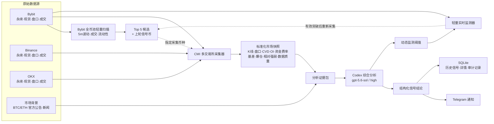

# Bybit 多源合约交易信号系统设计规格

- 日期：2026-08-17
- 状态：架构基线已由用户确认，待文档复核
- 阶段：V1，仅分析与通知
- 默认时区：Asia/Shanghai
- 默认模型：`gpt-5.6-sol`
- 默认推理强度：`high`

## 1. 背景与目标

本项目从零构建一个 24 小时运行的 USDT 线性永续合约交易机会分析系统。系统面向用户在 Bybit 手动判断和手动下单的工作流，每 30 分钟分析一次 Bybit 可交易币池，重点寻找 5m 波动活跃、流动性可接受、近期存在清晰方向与较近结构目标的山寨币，并通过 Telegram 推送简洁结论和可展开的分析详情。

Bybit 是目标市场、币种范围和通知参考价格的权威来源，但不是唯一证据来源。进入深度分析的币种由本地 Crypto Market Intelligence（CMI）采集 Bybit、Binance、OKX 的公开永续和可用现货数据，结合盘口、成交、订单流、持仓量、资金费率、基差、爆仓、BTC/ETH 市场环境等信息形成证据包，再交给 Codex 综合判断。

V1 不接入账户，不查询资金、仓位或盈亏，不设置杠杆，不计算下单数量，不创建、修改或取消任何订单。

## 2. 成功标准

1. 服务可在本地连续运行，并能由文档交接给 VPS 中的 Codex 完成部署。
2. 每个上海时间自然半小时至少产生一条 Telegram 周期通知。
3. 每轮扫描 Bybit 全量可用 USDT 线性永续，深度分析 Top 5 候选以及必须追踪的上轮信号币。
4. 每轮最多推送 2 个强交易信号；没有强信号时也推送候选概况。
5. 上一轮出现信号而本轮不再强的币，必须给出维持、减弱、失效或数据不可判定的复查结果。
6. 轻量监测器可在两次周期分析之间发现有效阈值突破，重新采集新数据并触发紧急分析。
7. Telegram 只承担通知、详情查看和最小运行状态，不承担交易控制或复杂配置。
8. 所有模型结论均可回溯到时间戳、数据质量、上下文哈希、证据 ID、工具状态和原始快照引用。

## 3. 非目标与硬边界

- 不自动下单，不提供一键下单按钮。
- 不接入 Bybit 私有 API 或 Demo 私有交易流。
- 不保存交易所 API Key/Secret。
- 不输出保证金、杠杆、仓位比例、下单数量或预期净利润。
- 不承诺信号盈利，不把波动率、回测或模型预测称作盈利证明。
- 不跨交易所平均价格。所有价格保留交易所、市场类型、价格类型和时间戳。
- 不以缺失数据代表零，不因单个可选工具缺失而机械扣分。
- 不复用两个 Binance MCP 参考仓库中的账户、钱包、理财和交易工具。
- 不把 MCP HTTP 服务无认证暴露到公网。

## 4. 参考资料审查与取舍

### 4.1 `nirholas/Binance-MCP`

可参考 MCP 工具注册、stdio/SSE 传输和错误封装。其实际注册模块主要面向 Binance 现货、钱包、理财等，源码明确没有注册 USD-M/COIN-M Futures，因此不作为本系统业务底座。

### 4.2 `junsonle/Binance-mcp`

仅参考 Streamable HTTP 的会话生命周期。该分支存在大量 TypeScript 编译错误，构建脚本会吞掉 `tsc` 失败，HTTP 默认监听所有网卡、允许任意 CORS 且没有认证，不能原样部署。

### 4.3 `followers-asm` 的 `refactor/bitget-btc-codex`

采用：

- 已完成 K 线和无前视数据原则；
- Codex 是策略结论主体，脚本只负责采集、计算、筛选、监测和校验；
- 严格 JSON Schema、`analysis_id` 回显校验、工具状态说明；
- 只读沙箱、受限环境变量、超时与错误分类、Token 用量审计；
- 上下文哈希、证据 ID、动态阈值、迟滞、锁存与阈值族状态继承；
- 价格行为和量化知识模块作为软证据；
- Freqtrade/VectorBT 仅用于离线无前视与敏感性验证；
- Kronos 可选、失败不阻断。

排除：

- 账户、持仓、保证金、杠杆、盈亏和执行器；
- 与开仓、补仓、止损执行、撤单绑定的状态机；
- 按 20U、杠杆和净盈利目标计算的目标接近度公式。

### 4.4 本地 CMI 与历史 Prompt/对话

CMI 是深度采集主入口。采用其多交易所公开行情、原子快照、健康状态、部分成功和明确数据限制语义。

采用历史 Prompt/对话中的以下结论：

- 核心结论优先；
- 强信号必须是唯一方向和单一大致止盈；
- 明确当前形成中 1h 的时间窗口、方向与强弱；
- 给出方向失效条件；
- 先根据本轮新证据独立形成结论，再与上一轮比较；
- 工具缺失时继续综合现有证据，不使用固定投票权重；
- 新闻与项目身份必须通过符号、代币名和项目名交叉核对。

不采用图像绘制专用流程、D/T/P 评分、固定票权和机械硬门槛。

### 4.5 审查版本与差异修正矩阵

本轮审查基线包括：`nirholas/Binance-MCP@df8861c`、`junsonle/Binance-mcp@cbb849c`、`followers-asm/refactor/bitget-btc-codex@dd29966`、本地 CMI 2.2.1、本地 `sol_realtime_snapshot` 源码和用户指定的最终 Prompt/对话结论。

| 发现的差异或遗漏 | 严重度 | 证据 | 本设计的修正 |
|---|---:|---|---|
| 早期架构把 Bybit 画成几乎唯一上游 | 高 | CMI 样例同时包含 Bybit/Binance/OKX、现货/永续和多类衍生品证据 | Bybit 只负责目标币池和权威价格，CMI 提供多源深度证据 |
| CMI 箭头方向容易被理解为 CMI 向交易所分发数据 | 中 | CMI README 明确其从三所采集公开数据 | 图中改为交易所源数据进入 CMI，候选选择仅作为控制流 |
| 遗漏无前视量化知识、证据 ID 和工具状态 | 高 | followers 的 `knowledge.py`、`context.py`、Codex 输出契约 | 增加证据构建层、上下文哈希、工具评估和来源校验 |
| 目标接近度曾与 20U、杠杆和净利润绑定 | 高 | followers alt 筛选公式与用户后续明确删除仓位需求冲突 | 改为结构距离、波动尺度、流动性和盘口可达性 |
| 监测仅有阈值，缺少迟滞、锁存和阈值族继承 | 高 | followers `monitoring.py` | 指令包含迟滞、有效期、证据和 family ID，只在真实跨越时触发 |
| 上一轮方向可能锚定本轮模型 | 高 | 用户指定“先形成新结论，再比较上一轮” | 本轮模型不接收历史方向/目标，落地后由协调器比较 |
| 缺少离线无前视和费用敏感性验证 | 中 | followers tooling evaluation、Freqtrade/VectorBT 适配 | 加入独立研究/QA 平面，不进入实时决策主链路 |
| Telegram 参考实现含大量账户和控制逻辑 | 中 | followers 通知模块同时包含交易控制按钮 | 仅保留通知、详情、最新信号、状态和帮助 |
| Streamable HTTP 参考分支默认公开且构建吞错 | 高 | `origin: "*"`、监听 `0.0.0.0`、`tsc || exit 0` 和编译错误记录 | 默认 stdio/localhost；远程必须认证；任何构建失败均非零退出 |
| Kronos 和外部研究可能拖慢多币种周期 | 中 | 参考资料记录单次预测/分析存在明显延迟 | `auto`、只处理最终候选、严格超时、失败不阻断 |

## 5. 权威层级

当资料冲突时按以下顺序处理：

1. 当前用户已确认的 V1 边界和通知需求；
2. 交易所与 Telegram 官方接口语义；
3. CMI 实际可输出的数据与健康状态；
4. 本设计规格和开发需求文档；
5. 参考项目实现；
6. 可选研究工具输出。

任何参考实现不得覆盖“纯信号、无账户、无下单”的硬边界。

## 6. 总体架构



实线表示数据流，虚线表示控制流。CMI 接收交易所源数据；筛选器仅指定需要采集的币种。

## 7. 组件设计

### 7.1 配置与启动

使用版本化 YAML 配置和环境变量密钥覆盖：

- 非敏感项：调度周期、候选数、数据窗口、监控限频、CMI 路径、SQLite 路径、日志级别；
- 敏感项：Telegram Bot Token、允许的 Chat ID/User ID；
- Codex：可执行文件、模型、推理强度、超时、工作目录；
- 可选工具：Kronos、新闻/公告适配器、离线研究工具。

启动前执行 preflight，检查 Codex、CMI、目录权限、SQLite、网络和 Telegram 配置。可选组件不可用时标记为 `UNAVAILABLE`，核心组件不可用时服务进入降级或不健康状态。

### 7.2 Bybit 全币池扫描器

职责：

- 从 Bybit 公共 API 获取当前可交易的 USDT 线性永续合约；
- 只使用公开数据，不需要 API Key；
- 使用已完成 5m K 线计算近期波动、成交活跃度、连续性和结构距离；
- 结合成交额、盘口价差和数据完整性排除无法可靠手动交易的币；
- 产生排名候选，不产生交易方向。

候选排名不得包含保证金、杠杆、仓位或预期净利润。示例币种 GPS、TUT、ALICE、AIO、PORTAL、CYS、BTW、HEMI、SNXX、H 仅为偏好提示，不是固定白名单。

### 7.3 CMI 适配器

输入是一个规范化 Bybit 合约符号，输出是不可变的深度快照引用。

适配器负责：

- 调用 Windows 已安装 CMI 或源码入口；
- 为 VPS 提供可配置的源码/可执行入口，而不写死本机路径；
- 遵守同一币种单实例约束，不同币种按资源上限并发；
- 等待原子 `latest.json`、文本摘要和健康文件；
- 校验币种身份、schema 版本、生成时间、数据新鲜度和完整性；
- 保存快照路径、内容哈希和数据限制；
- 超时后读取健康状态，不把旧文件误当作本轮新数据。

CMI 允许部分交易所失败。若 Bybit 数据仍可靠且其他证据足够，分析可以继续；若币种身份或核心 Bybit 证据不可读，则该币本轮只能输出数据异常。

### 7.4 市场背景适配器

背景数据低频缓存，不在每轮重复抓取全部互联网信息：

- BTC/ETH 走势、波动与山寨币相对强弱；
- Bybit 或项目官方公告；
- 必要时的代币解锁、上线/下线和重大事件；
- 可选的低频宏观背景。

新闻只作辅助证据。必须核对标题、发布方、URL、正文和时间；符号歧义使用“symbol + token name + project name”确认。适配器未配置时不阻断主流程。

### 7.5 证据构建器

把 CMI 快照压缩成模型可用、无密钥、带来源的上下文：

- Bybit 最近 `last` 和可选 `mark`，分别保留；
- 已完成 5m、15m、1h、4h K 线及有限长度窗口；
- 当前形成中 K 线单独标识，绝不混入已完成序列；
- 多交易所永续与现货差异，不进行均价；
- 成交 Delta、CVD、大额成交、扫单和吸收；
- OI、资金费率、基差、多空比、爆仓；
- 盘口深度、价差、失衡与滑点估计；
- 技术结构和基于实际成交分布的量价证据；
- BTC/ETH 环境与相对强弱；
- 所有数据限制、新鲜度、工具状态和证据 ID。

确定性量化知识仅作软证据，可包含趋势回归、ATR、枢轴、斐波那契、Dow/2B、周期、量能和形态提示。禁止用未来数据，禁止把启发式标签描述成事实。

### 7.6 可选 Kronos

Kronos 采用 `auto` 模式：只有预检通过且资源、延迟预算允许时，才对最终候选运行。输入只包含已完成 5m OHLCV/turnover，输出未来 12 根 5m 的方向概率和收益分位数。它是需要在模型结论中披露状态的软证据；超时、缺模型或结果过期均不阻断分析。

### 7.7 Codex Runner

默认以如下安全原则调用本地 Codex：

- `codex exec --json --ephemeral --sandbox read-only`；
- 指定 `gpt-5.6-sol` 和 `model_reasoning_effort=high`；
- 使用严格输出 Schema 和临时输出文件；
- 仅传递白名单环境变量；
- 校验进程退出码、超时、JSON、Schema、`analysis_id` 和必需工具状态；
- 记录输入哈希、输出哈希、耗时和 Token 用量；
- 不在普通日志中写入完整模型输出或 Telegram Token。

Codex 是方向和策略结论的唯一综合判断者。筛选分数、Kronos、价格行为和订单流均为证据，不使用固定投票权重。

### 7.8 周期分析协调器

每个自然小时的 `:00` 与 `:30` 启动一次：

1. 为本轮生成 `analysis_id`，锁定截止时间和上一轮追踪集合；
2. 更新 Bybit 合约列表并完成全币池轻量扫描；
3. 选择 Top 5，并并入上一轮强信号币；
4. 对所需币种采集新 CMI 快照；
5. 构建证据包和可选软证据；
6. Codex 仅根据本轮新证据独立输出每个候选/追踪币的当前判断，不向该决策阶段提供上一轮方向或目标；
7. 当前判断通过校验并落地后，由协调器读取上一轮结构化结果，生成“相比上一轮”和追踪状态；
8. 最多选出 2 个强信号并生成监测指令；
9. 原子保存本轮结果后发送 Telegram；
10. 更新监测策略和下一轮追踪集合。

若本轮没有强信号，仍发送 Top 候选简报。上一轮信号币必须返回以下状态之一：

- `MAINTAINED`：方向和主要结构仍有效；
- `WEAKENED`：方向未完全失效，但已不属于较强信号；
- `INVALIDATED`：失效条件已经满足；
- `INDETERMINATE`：本轮核心数据不可判定。

为避免历史锚定，上一轮结论不得进入本轮市场方向的模型证据包。每个被分析币都应先输出当前强弱、方向、目标和失效结构；跨轮比较只消费已经校验的当前结构化结果和历史结构化结果。

### 7.9 结构化输出契约

每个强信号至少包含：

- `analysis_id`、币种、生成时间；
- Bybit 参考价格、价格类型和行情时间；
- 唯一方向：`LONG_BIAS` 或 `SHORT_BIAS`；
- 当前市场状态；
- 一个大致止盈位及其结构依据；
- 当前形成中 1h 的方向、强弱和上海时间窗口；
- 与上一轮的比较；
- 可执行判断所需的方向失效条件；
- 简短结论、详细分析、风险与不确定性；
- 证据 ID 和工具状态；
- 有期限的动态监测指令。

“较近止盈”按当前结构、波动尺度、盘口可达性和跨交易所确认解释，不引用用户仓位或利润金额。

### 7.10 实时监测器

监测器使用轻量 Bybit 公共 WebSocket/REST，而不是持续执行完整 CMI。它包含两类规则：

1. 通用异常：短时价格、成交量、Delta、价差、爆仓或波动突变；
2. Codex 动态指令：价格结构、完成 K 线、成交/订单流、OI/资金费率等阈值。

只有实时监测器实际能获得的指标才能成为动态指令。每条指令包含：

- 指标和可选方向；
- 比较符、阈值和迟滞值；
- 有效期；
- 原因和证据 ID；
- 稳定的阈值族 ID。

触发条件必须是真实跨越。锁存后只有退回迟滞区间才重新武装。默认事件合并窗口 60 秒、单币冷却 10 分钟、全局模型紧急分析软上限每小时 10 次。方向失效和极端波动可以越过软上限，但必须写入越界原因。

有效事件不会直接发送交易结论，而是重新采集 CMI、构建新证据、运行一次紧急 Codex 分析，再发送提醒。

### 7.11 Telegram 通知器

Telegram 定位为通知终端：

- 周期结论；
- 紧急变化提醒；
- 查看分析详情；
- 最新信号、系统状态和帮助。

主导航统一使用：

```json
{
  "resize_keyboard": true,
  "is_persistent": false,
  "one_time_keyboard": false
}
```

系统中禁止构造 `ReplyKeyboardRemove`，禁止出现 `remove_keyboard`。主导航保持最小化，信号消息使用 InlineKeyboard 的“查看分析详情”。回调数据不超过 64 UTF-8 字节，回调先应答，再编辑原消息；编辑失败则降级为发送新消息。

启动和 `/start`、`/menu` 会重新发送 ReplyKeyboard；同时配置 `/latest`、`/status`、`/help` 命令及私聊命令菜单。Telegram 客户端最终控制输入框旁图标的显示，服务端提供可恢复入口但不作无法保证的承诺。

Bot 只响应允许的 Chat ID 和 User ID。配置通过 YAML/环境变量完成，不在 Telegram 内建设复杂配置中心。

### 7.12 状态、审计与 MCP/CLI

SQLite 保存：

- 周期与紧急分析运行记录；
- 候选排名和入选原因；
- 信号、追踪状态和监测策略；
- 快照引用、哈希、数据时间和限制；
- Codex 工具状态、耗时和 Token 用量；
- Telegram 投递与回调结果；
- 服务健康和错误摘要。

原始大 JSON 保存在轮转文件目录，SQLite 只保存索引和必要字段。

系统提供只读 CLI/MCP 工具，便于本地或 VPS Codex 检查：

- `get_system_health`；
- `scan_candidates`；
- `get_latest_signal`；
- `get_signal_details`；
- `get_market_snapshot`；
- `get_monitoring_status`；
- `get_analysis_history`。

允许提供“立即分析”作为本地运维动作，但它只能触发采集与通知，不能触发交易。MCP 默认使用 stdio 或仅监听 localhost；远程 HTTP 必须由认证反向代理保护。

## 8. Telegram 核心消息格式

```text
核心结论｜CYSUSDT

最近参考价格：0.6041 USDT
来源：Bybit CYSUSDT 永续 last
行情时间：2026-08-17 15:48:07 UTC+8

综合方向：偏空
当前市场状态：趋势下跌中的超卖反抽 / 低位修复
大致止盈位：0.5780 USDT
当前形成中 1h：下跌；一般（15:00–15:59）
相比上一轮：方向不变，反弹动能增强，目标有所收缩
方向失效条件：5m/15m 稳定站上 0.6230

简短结论段落……

[查看分析详情]
```

不显示仓位、保证金、杠杆、下单数量、盈亏金额或自动执行建议。

## 9. 失败处理与降级

### 9.1 数据失败

- 单个非 Bybit 交易所失败：保留限制说明，使用剩余数据；
- CMI 部分字段缺失：字段为未知，不填零；
- Bybit 核心行情陈旧或币种身份错误：不生成该币方向；
- 全币池扫描失败：发送一次系统异常通知，不复用旧排名冒充新一轮；
- CMI 超时：检查健康文件和生成时间，绝不误读上一轮旧快照。

### 9.2 模型失败

- 对可重试的临时错误、限流或超时进行有限重试和退避；
- Schema、`analysis_id` 或证据引用错误视为无效输出，可进行一次修复重试；
- 超过本轮截止时间后发送“本轮分析失败/数据状态”通知；
- 不使用未通过校验的自由文本拼装信号。

### 9.3 Telegram 失败

- 记录 API 错误和投递状态；
- 使用有限重试，避免重复发送同一幂等消息；
- Telegram 不可用不阻断分析落库；恢复后可补发最新未送达摘要；
- 回调过期时发送新的详情消息。

### 9.4 重启恢复

启动时从 SQLite 恢复上一轮信号、监测指令、冷却状态和 Telegram 更新 offset。过期监测指令不会恢复。若正在进行的分析没有原子完成，则标记为中断并启动新一轮，不发布半成品。

## 10. 安全设计

- V1 不存在交易所私钥和下单权限；
- Telegram Token 只从环境变量或受限密钥文件读取；
- 日志脱敏，不记录 Token、完整环境变量或 Codex 认证信息；
- Codex 子进程使用只读沙箱和环境变量白名单；
- 外部命令参数使用结构化参数列表，不拼接 shell；
- CMI 输出、模型输出和 Telegram 回调都进行 Schema/长度/身份校验；
- MCP 网络服务默认不公网暴露；
- 所有依赖版本固定，构建和测试失败必须返回非零退出码。

## 11. 测试与灰盒验证

### 11.1 单元测试

- 完成 K 线与形成中 K 线分离；
- 候选筛选不含仓位/盈利公式；
- 多交易所价格不被平均；
- `null`、零值和 `WARMING_UP` 语义；
- 上轮信号强制追踪；
- 阈值跨越、迟滞、锁存、阈值族继承、合并与限频；
- Telegram ReplyKeyboard 固定参数，并验证生产代码生成的任何 markup 都不含移除键盘字段；
- callback 长度、白名单和回调应答顺序；
- 输出 Schema、证据 ID、哈希和 `analysis_id`。

### 11.2 集成测试

- 使用录制 Bybit/CMI 数据完成整轮扫描到落库；
- CMI 单所失败、超时、陈旧快照和错误币种；
- Codex 正常、超时、无效 JSON、Schema 缺字段、限流；
- Telegram 模拟 API 的发送、编辑失败降级、重启菜单恢复；
- SQLite 重启恢复和幂等通知。

### 11.3 端到端测试

在禁用任何交易接口的环境中运行：

1. 调度器启动整轮分析；
2. Top 5 和上轮信号完成 CMI 采集；
3. Codex 输出最多 2 个强信号；
4. Telegram 沙箱接收摘要并可查看详情；
5. 注入价格/成交阈值突破；
6. 验证合并、冷却、新快照和紧急提醒；
7. 重启服务并验证追踪与键盘恢复。

### 11.4 灰盒场景

代表性场景：

- 14:00 CYS 进入 Top 5，三所数据可用，Codex 发布偏空信号；
- 14:12 Bybit 价格上穿失效结构且成交 Delta 反转，监测器触发一次；
- 事件在 60 秒内合并，系统重新采集 CMI 并发送紧急复查；
- 14:30 周期分析仍执行；若 CYS 不再强，通知明确为 `WEAKENED` 或 `INVALIDATED`；
- 假设 OKX 缺失，系统标记数据限制而不把其值当零；
- Telegram 详情按钮可展开，ReplyKeyboard 未被移除；
- 全流程不存在交易所私有 API 和订单调用。

### 11.5 离线研究验证

Freqtrade/VectorBT 只消费固定哈希、已完成 K 线的历史数据，用于检查无前视、费用/资金费率敏感性和阈值稳定性。研究结果有生成时间、样本数量和有效期，只能作为后续改进依据，不能覆盖当前市场事实。

## 12. 运维与部署

本地 Windows 提供 PowerShell 安装、预检、前台运行和后台服务脚本。VPS 提供 Linux 环境检查、Python 虚拟环境或容器部署、systemd/容器守护、日志轮转、健康检查和升级回滚说明。

CMI 本机可使用已安装路径，但配置中必须支持可移植入口。若 VPS 无法直接使用 Windows 安装包，部署 Codex 应根据 CMI 源码和适配器文档安装等价采集入口。

健康状态至少包括：

- 最后一次成功扫描、CMI 采集和 Codex 分析时间；
- 下一次周期分析时间；
- WebSocket、CMI、Codex、SQLite、Telegram 状态；
- 最近一小时周期/紧急调用数和 Token 用量；
- 当前追踪币种、监测规则数量和最近错误。

## 13. 已确认决策

1. V1 只通知交易机会，用户手动判断和交易。
2. Bybit 是目标市场和价格基准，深度证据不只来自 Bybit。
3. 每 30 分钟固定通知一次。
4. Top 5 深度分析，最多 2 个强信号。
5. 上一轮信号币本轮必须复查并通知状态。
6. 保留轻量实时监测和紧急 Codex 唤醒。
7. 默认模型 `gpt-5.6-sol`，推理强度 `high`。
8. Telegram 以通知为主，仅保留详情和最小状态菜单。
9. CMI 是交易所源数据的采集/标准化组件，不是源数据本身。
10. V1 不包含任何仓位或自动交易功能。

## 14. 实现前待配置项

以下不改变架构，可在部署时补充：

- Telegram Bot Token、允许的 Chat ID/User ID；
- 本地 Codex 登录状态和可执行路径；
- VPS 操作系统、CPU、内存和部署目录；
- VPS 上 CMI 的具体运行入口；
- 是否为低频公告/新闻配置额外数据提供方。

这些配置缺失不妨碍先实现可测试的系统骨架和模拟端到端测试。
