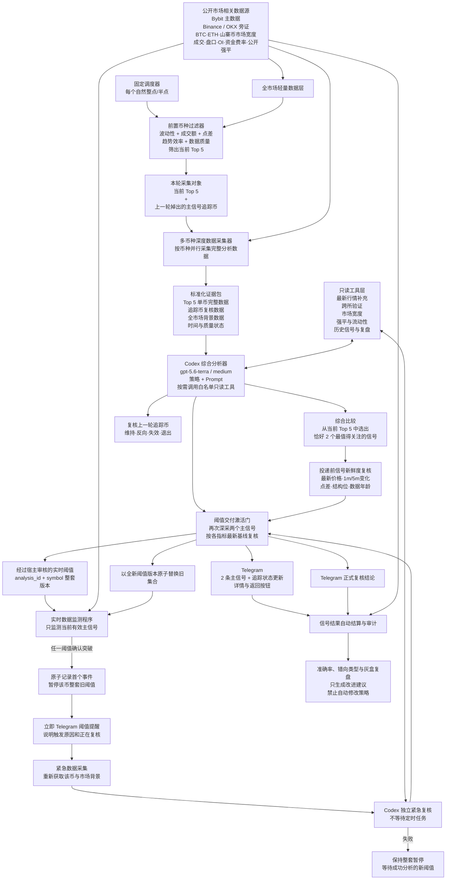

# Bybit 超短线信号系统架构重构设计

> 历史设计说明：本文件保留 2026-08-18 的架构推导与实施背景。当前完整权威设计是 [`2026-08-19-model-centered-signal-system-reliability-design.md`](2026-08-19-model-centered-signal-system-reliability-design.md)。与其冲突的目标、宿主策略门槛、微观独立唤醒、串行等待或失败语义均已废止。

日期：2026-08-18  
状态：已实现并于 2026-08-18 完成全量复核
范围：公开市场数据、Top 5 过滤、Codex 综合分析、Telegram 信号、实时阈值、紧急复核、结果审计  

## 1. 目标与边界

系统每个自然整点和半点执行一次固定流程：从 Bybit USDT 线性永续全市场中筛选 5 个适合山寨币超短线分析的币，采集完整公开市场数据，交给经三轮灰盒选出的 `gpt-5.6-terra / medium` 综合分析，从当前 Top 5 中选出恰好 2 个最值得人工关注的主信号，通过 Telegram 通知用户。

每条主信号同时生成一组真正会改变方向、目标可达性或市场状态的实时监测阈值。阈值突破时先立即发送简短提醒，再重新采集该币和全市场背景，使用独立紧急 Codex 通道生成正式复核结论。

本系统只提供公开市场信号，不接触交易所私有 API，不读取账户、余额、仓位、保证金或盈亏，不生成数量、杠杆或订单，不自动下单。

参考项目、CMI、Kronos、TradingAgents、历史 Prompt 和用户提供的其他资料只用于理解设计与源码方法。生产系统自行实现与当前需求匹配的数据合同和组件，不直接复制、拼装或依赖不受控黑盒。

## 2. 总体架构

选择双通道编排，而不是单流水线或全市场永久深度流：半小时主流程与紧急流程共享数据合同、工具白名单、状态存储和审计能力，但不共用会导致紧急任务排队的阻塞锁。只为当前 Top 5 和两个主信号维护轻量实时缓存。

## 3. 固定半小时主流程

1. 调度器在自然整点或半点启动，生成唯一 cycle ID 和统一证据截止时间。
2. 全市场轻量数据层获取所有可交易 Bybit USDT 线性永续的低成本公开数据。
3. 前置过滤器完成基础准入和机会/可交易性评分，输出当前 Top 5、原始特征、入选理由和风险标签。
4. 采集对象由当前 Top 5 与上一轮掉出 Top 5 的主信号组成，按符号去重。
5. 深度采集器并行构建单币完整快照，同时构建 BTC、ETH、山寨币宽度和跨币种同步性等市场背景。
6. 证据构建器输出自包含的标准数据包，并保留每项数据的来源、时间、覆盖、质量和失败原因。
7. Codex 先独立分析每个 Top 5，再横向比较，恰好选择 rank 1 和 rank 2；追踪币单独判断生命周期，不占 Top 5 或新信号名额。
8. 宿主校验 Schema、证据引用、方向/目标/失效几何、最近目标、置信度约束、阈值合理性和工具调用记录。
9. 投递前重新检查两条主信号的最新行情和结构。轻微变化时更新展示价格并重新验证；实质变化时旧结论不得发送，进入快速修复分析。
10. 模型和追踪币复核完成、信号新鲜度通过后，再次深采两个主信号并执行阈值交付激活：每条阈值必须相对所属指标的最新基线重新计算当前值、距离和迟滞；已穿越、贴噪声、过远或缺少合格基线的单条阈值被剔除。Telegram 参考价同步为该激活快照的 Bybit last，目标与失效必须仍包围这个最终价格。每个可见信号仍须至少保留一条结构类阈值，否则整轮失败且不投递。
11. 成功周期原子保存证据、结论和激活后的阈值，并向 Telegram 发送恰好两条主信号及必要的追踪状态更新。
12. 实时监测器原子替换为当前两条主信号的有效阈值；掉出主信号集合的币停止实时监测。

核心数据不足或快速修复失败时，该周期标记为失败并发送明确故障通知，不能为了满足数量合同伪造两条信号。只有成功定时周期必须恰好有两条主信号。

## 4. 全市场轻量数据与 Top 5 过滤

### 4.1 基础准入

- 只接受正常连续交易的 Bybit USDT 线性永续；新币和老币都可以，不按上线时间排除。
- 初始安全底线沿用已确认的量级：24h 成交额约 150 万 USDT、最近完成 30m 成交额约 5 万 USDT、spread 约 25 bps。
- 阈值可以随全市场流动性分位动态修正，但不得为了提高数量把绝对安全线降到不可解释水平，也不得无证据整体抬高一倍。
- 最近完成 K 线必须连续、时间对齐并满足最低样本要求。

### 4.2 机会评分

使用约 72 根已完成 5m K 线计算：

- 中位振幅、实现波动率和最大单根绝对涨跌；
- 最近 15m/30m 绝对成交额与相对放大倍数；
- 当前波动相对 ATR 的活跃程度；
- 趋势效率、K 线重叠、连续推进和冲击后变化；
- 距离最近可验证结构目标的空间；
- 突破、假突破、冲击衰竭、急跌反抽等值得深查的状态。

过滤器不判断最终多空，不因涨幅榜、跌幅榜或单根异常直接生成方向。

### 4.3 可交易性评分

- 24h 与最近 30m 成交额；
- ticker spread 与有效盘口深度；
- 盘口是否出现流动性断层或快速恶化；
- 成交活跃度是否由极少数异常成交制造；
- 方向效率、重叠度和价格连续性；
- 数据完整性与时间一致性。

内部保留 `OpportunityScore` 和 `TradabilityScore`。最终排名以机会为主、可交易性作约束。成交额处于低档但仍高于安全线的币可以进入 Top 5，不过必须带 `THIN_LIQUIDITY` 等风险标签，供 Codex 降低置信度或选择其他候选。

上一轮主信号不因历史身份占用 Top 5。若其掉出 Top 5，仍作为额外追踪币重新采集和复核；即使原结构尚未完全失效，也不继续占用当前两条主信号的实时监测名额。

## 5. 深度数据采集与证据合同

### 5.1 单币数据

每个 Top 5 和追踪币至少采集：

- 约 240 根完整 1m K 线；
- 约 239 根完整 5m、15m、30m、1h、4h K 线；
- 最近约 30 根紧凑 1m OHLCV、最近若干根 5m/15m 原始 OHLCV；
- Bybit last、mark、index、ticker、盘口与有效深度；
- 近期公开成交及主动买卖方向；
- OI、OI 变化、资金费率和公开多空账户比例；
- 近期公开强平事件和异常成交；
- Binance/OKX 同币种公开旁证（存在时）。

1m 用于超短线时机、模型分析期间漂移、假突破、投递前复核和快速阈值；5m/15m 决定近端结构；30m/1h/4h提供背景。形成中 1m/5m 可以描述实时状态或初始化监测基线，但不得冒充完成柱确认结构。

### 5.2 全市场背景

- BTC、ETH 同期 1m/5m/15m 状态；
- Bybit USDT 永续上涨/下跌数量、收益分布和成交额宽度；
- Top 候选间同步性和山寨币整体风险切换；
- 全市场公开强平聚集和流动性异常；
- 必要的跨所一致性。

“市场所有相关数据”在本设计中表示上述有明确用途、时间和质量合同的公开数据，不表示无边界抓取所有字段或允许 Codex 不受控访问网络。

### 5.3 存储与 Prompt 大小

完整快照保存在本地审计存储。基础 Prompt 只携带统计特征、关键结构、最近紧凑序列和市场背景；Codex 需要更多原始历史时通过白名单工具按需读取，避免无限扩大输入和模型延迟。

## 6. Codex、策略、Prompt 与工具

### 6.1 分析流程

1. 校验身份、统一截止时间、新鲜度和字段质量。
2. 判断 BTC/ETH、山寨币宽度、跨币种同步和强平环境。
3. 不读取旧方向，独立分析每个 Top 5。
4. 每币比较“趋势延续”与“假突破/冲击衰竭”两个互斥解释。
5. 价格行为和结构优先；流动性、订单流、OI、资金费率、强平和跨所只作确认或反证。
6. 横向比较当前 Top 5，选出恰好两个相对最佳机会。
7. 单独复核追踪币的维持、转弱、反向、失效或退出。

### 6.2 白名单只读工具

Codex 可以按需调用：

- 最新行情和短周期 K 线刷新；
- 市场宽度与跨币种联动；
- 盘口深度、近期成交和流动性；
- OI、资金费率、多空比例和公开强平；
- Binance/OKX 跨所验证；
- 历史信号、预测结算和同类错误检索；
- 版本化价格行为、趋势/区间、突破/假突破、波动与流动性分析模块。

每次调用保存工具名、版本、参数、数据时间、结果摘要、耗时、状态和引用证据。工具限时且按字段降级；可选工具失败不能阻塞整轮。禁止账户、仓位、订单、私有凭据和不受控网络工具。

### 6.3 两条主信号与置信度

从当前 Top 5 中按未来 15–30 分钟方向清晰度、最近目标可达性、快速失效可验证性、价格延伸程度、可交易性、市场宽度和反证强度进行相对比较。固定两条只规定成功周期的数量，不表示必须给 `HIGH`。

以下任一情况存在时不得给 `HIGH`：

- 关键周期方向冲突；
- 临近主要前高/前低但尚未有效确认；
- OI、成交、盘口或市场宽度没有同步确认；
- 方向效率低、K 线重叠严重；
- 流动性薄或 spread 明显偏大；
- 关键数据或工具结果接近过期；
- 目标前存在更近的有效结构。

宿主验证目标是方向前方最近的可解释结构，避免跳过更近 pivot 选择更远目标。四项 K 线预测继续为形成中 15m、形成中 30m、形成中 1h 和下一根完整 15m。

### 6.4 策略治理

Prompt、策略模块、数据合同和宿主规则均版本化。禁止根据 ACU、FHE 或单次结果添加“靠近前高就做空”等样本专用规则。任何策略修改必须经过自动结算、错误归因、多样本历史回放、旧版对照和用户确认。生产程序不得自动修改 Prompt 或策略。

## 7. 投递前新鲜度闸门

Codex 完成后，发送 Telegram 前重新获取两条主信号的：

- latest last/mark 与时间；
- 最近完成 1m/5m；
- 模型运行期间的方向性漂移和 ATR 距离；
- spread、盘口有效深度和原失效位状态；
- 全市场背景是否发生显著切换。

轻微变化时更新通知展示价并重新校验目标、失效和阈值；快照年龄过大、价格反向漂移明显、结构已失效、spread/深度恶化或市场状态切换时，不发送旧结论，使用更新后的 Top 5 证据进入小范围快速修复分析。快速修复仍失败则周期失败，不能发送过期信号。

新鲜度闸门只判断“旧结论是否仍可投递”，不能自行翻转方向。

## 8. 实时阈值与紧急通道

### 8.1 阈值类型

Codex 可以按需要提出多个阈值，覆盖：

- last/mark 快速失效；
- 1m/5m/15m 完成柱结构确认；
- 目标接近或穿越；
- 短时间动态 ATR 异常；
- spread、有效深度或流动性恶化；
- OI、资金费率、公开强平异常；
- 山寨币宽度或 BTC/ETH 背景切换。

阈值数量不设置 1–2 条业务限制。同一语义去重后通常每币 3–6 条；每币硬安全上限为 8 条，仅用于拒绝异常模型输出，不作为必须凑满的数量。

### 8.2 宿主校验

每条阈值必须包含指标、比较方向、当前观测、阈值、来源证据、结构意义、距离百分比或 ATR 倍数、确认周期、迟滞、严重等级和有效期。

宿主拒绝已穿越、距离过远、距离过近、语义重复、无法追溯或实现不支持的阈值。合理性使用当前 ATR、结构位置、spread、数据频率和市场噪声动态判断，不使用一个固定百分比覆盖所有山寨币。last、mark、完成 1m/5m/15m/1h 必须分别相对自己的最新基线计算距离，不能统一借用 last 掩盖“离完成柱仅一个跳动”的阈值。成交 delta、1m 成交额、OI、spread、盘口和强平使用本窗口规模计算动态噪声底线；滚动成交 delta 轻微穿越零轴不能单独唤醒 Codex。

### 8.3 状态机

- 新指令加载后立即使用最新实时值初始化基线；不能等到第一根完成柱才初始化。
- 形成中 K 线可用于初始化，但只有 `confirm=true` 的完成柱能确认完成柱规则。
- 订阅后的第一根新完成柱发生真实穿越时必须触发，不能被当作启动基线吞掉。
- 每个 `(analysis_id, symbol)` 是一整套一次性阈值版本：任一 family 确认穿越后，只原子接受并持久化首个事件，随即暂停该版本全部 sibling 指令；离开迟滞区也不得重新武装，进程重启后从 SQLite 恢复整套暂停状态。
- 迟滞仅用于首次穿越前的噪声隔离；盘口、成交 delta 和 spread 还必须连续满足配置秒数。30 秒成交窗口和 1 分钟强平窗口未完整预热时不得产生观测事件。
- 任一阈值确认后都立即原子接受首个事件并暂停整套版本，不再等待事件合并窗口；后续同类或 sibling 事件直接拒绝。
- 旧阈值持续有效到每个自然半小时定时任务真正开始，在 `:00/:30` 边界持久化冻结。边界前已经落库的紧急复核允许独立完成，定时任务按时启动且不等待，版本 CAS 防止迟到结果覆盖新定时版本。
- 预冻结状态跨进程重启恢复。定时分析失败时保持冻结，不能回退旧阈值；只有新的成功定时结论落库并完成投递尝试后，才解除冻结并激活其全新阈值。
- 普通 Codex 唤醒以约每小时 10 次为软预算；超过预算只记录异常速率，不能吞掉定时边界前已经确认的突破。频率由动态噪声、整套一次性暂停和完成柱结构共同约束。

### 8.4 两阶段紧急通知

1. 阈值确认后立即发送币种、指标、阈值、实际值、结构含义和“正在复核”。
2. 紧急采集器重新获取该币完整数据和最新市场背景。
3. 独立紧急 Codex 通道立即分析，不等待定时任务。
4. Telegram 补发维持、转弱、反向、失效或退出结论。
5. 新结论必须生成基于本次证据的新阈值，并原子替换旧阈值；即使旧方向失效或反转，也要围绕新状态继续监测。

紧急 Codex 未生成新阈值视为输出失败。失败时保留原始阈值提醒与整套暂停状态，不再监测旧集合中的任何 sibling 指令；只有后续成功紧急或定时分析发布新 analysis ID 的完整集合后才能恢复监测。旧阈值持续到定时任务开始边界；边界前已确认的事件仍必须依次完成暂停、提醒、重采和紧急复核，定时任务与其独立运行，不能吸收或静默丢弃。

## 9. 状态、审计与结果反馈

SQLite 或后续等价存储至少记录：

- 调度周期、紧急周期和失败周期；
- 全市场过滤结果、Top 5 特征与风险标签；
- 完整快照位置、证据包、哈希和统一截止时间；
- Prompt、策略、Schema、工具和模型版本；
- Codex 工具调用、输出、宿主校验和修复分析；
- Telegram 立即提醒、正式通知和幂等状态；
- 当前有效主信号和监测阈值；
- 每项预测、目标、失效和实际行情结算结果。

系统自动结算形成中 15m/30m/1h、下一根 15m、目标触达和方向失效，生成方向准确率、延迟、最大有利/不利变化、错向类型和数据质量统计。结果只用于审计和生成复盘建议，不自动反馈到生产策略。

## 10. Telegram 合同

- 成功定时周期每次通知恰好两条主信号；内部 WATCH 不通知。
- 追踪币掉出主信号集合时发送单独状态更新，随后停止实时监测。
- 主信号包含参考价格和时间、方向、置信度、市场状态、目标、失效、四项 K 线预测、相比上一轮和关键不确定性。
- 详情使用 InlineKeyboard，并提供返回本轮按钮。
- 主导航继续使用 ReplyKeyboardMarkup：`resize_keyboard=true`、`is_persistent=false`、`one_time_keyboard=false`；任何流程禁止 ReplyKeyboardRemove 或 `remove_keyboard=true`。
- 阈值采用“立即事件提醒 + 正式 Codex 复核”两阶段通知。
- 所有通知幂等；服务重启、详情、菜单和 InlineKeyboard 不主动清除 ReplyKeyboard 状态。

## 11. 错误处理

- 全市场轻量数据失败：本轮失败，不沿用旧 Top 5。
- 单个候选深采失败：记录字段级失败；不足 5 个仍可分析，但成功周期必须有至少两个合格候选。
- 可选跨所或辅助工具失败：字段降级，不填零、不覆盖 Bybit 主数据。
- Codex 输出或宿主校验失败：携带最小反馈重试；永久模型错误不在同周期重复消耗。
- 投递前结构失效：进入快速修复；失败时不发送旧信号。
- 阈值事件：立即提醒与后续 Codex 结果分开持久化，后者失败不删除前者。
- WebSocket 断线：重新获取当前有效阈值和基线后订阅，避免旧订阅与首个完成柱丢失。
- 定时和紧急周期：使用独立工作队列和并发策略；数据库写入与阈值替换保持原子和幂等。

## 12. 分阶段验证与部署

### 12.1 当前 Codex 代替程序 Codex

正式启用程序模型前，由当前 Codex 检查过滤结果、数据包、工具能力和真实 no-notify 周期，并使用同一证据合同生成参考分析。参考结论在生成时不得读取未来行情；对应窗口完成后再结算。

### 12.2 程序 Codex 对齐

启用程序 Codex 后，对比其与参考分析的关键事实、时间边界、证据使用、方向、目标、置信度和阈值。无需逐字一致，但所有数值和判断必须可追溯。差异按数据、压缩、工具、Prompt、模型或宿主校验分类，不直接增加结果驱动规则。

### 12.3 必测场景

- FHE：已有完成柱反转证据时不能继续沿用高周期多向；
- ACU：临近前高、流动性薄和模型延迟时不能发送过期 `HIGH LONG`；
- 同批内部空向优于最终多向时的相对择优；
- 上一轮信号掉出 Top 5 后的额外复核和停止监测；
- 第一根新完成 K 线直接穿越阈值；
- 阈值过近、过远、已穿越、重复和迟滞；
- 定时与紧急周期并发，立即提醒不排队；
- 可选工具失败和核心数据失败；
- 模型期间行情漂移与投递前拦截；
- 恰好两条主信号、内部 WATCH 隐藏、Telegram 幂等和返回按钮。

### 12.4 测试层次

1. 单元测试：解析、完成柱、过滤、证据、阈值状态机、迟滞、限频和新鲜度。
2. 合同测试：数据包、工具审计、Codex Schema、目标/置信度/阈值校验。
3. 场景测试：定时、追踪、两阶段紧急、Telegram 和错误恢复。
4. 历史回放：ACU、FHE 及数据库内全部可结算周期。
5. 真实 no-notify 灰盒：全市场过滤、深采、工具和 Codex。
6. Shadow 模式：连续多个自然半小时周期，只记录不正式通知。
7. 正式 Telegram 灰盒：固定两条、详情、幂等、立即阈值提醒和正式复核。
8. 24/7：墙钟调度、重启、断线恢复、单实例、Windows 和 VPS。
9. 安全：无私有接口、账户、仓位、订单、API Key 或自动交易能力。

新实现先使用独立 shadow 状态运行，不直接覆盖当前正式状态。只有过滤、Codex 对齐、新鲜度、首次穿越、紧急优先、全量测试和真实灰盒全部通过后，才停止旧服务并原子切换到新服务。

## 13. 验收标准

- 全市场过滤稳定输出可解释 Top 5，成交额与点差门槛不离谱；
- 1m 与多周期数据、市场宽度、流动性和强平具有统一时间和质量合同；
- Codex 能使用完整基础包并按需调用白名单只读工具；
- 每个成功半小时周期恰好两条最值得关注的主信号；
- 上一轮掉出 Top 5 的信号得到额外复核但不占新名额；
- 过期结论在 Telegram 投递前被拦截；
- 阈值距离合理、首次真实穿越不丢失、关键事件立即提醒；
- 紧急复核不等待定时分析，失败也保留原始事件；
- 结果自动结算但不能自动修改策略；
- ACU、FHE 和并发/故障场景回放通过，且没有修复一个样本破坏其他样本；
- 全量自动化、真实灰盒、Telegram、24/7 和安全检查通过；
- 文档、架构图、配置和实际运行行为一致。
