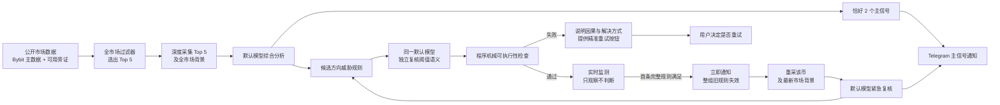

# 模型中心的 Bybit 超短线信号系统可靠性重构设计

> 状态：用户已确认；实现、真实模型灰盒和生产部署已完成。按币静默纠错与激活基线更新细节以 `2026-08-19-monitoring-review-auto-repair-design.md` 为补充权威。
>
> 权威顺序：本文件 > 2026-08-19 当前会话中用户的后续确认 > 当前生产事实与日志 > 旧设计和旧测试报告。2026-08-18 的架构重建设计、实施计划及其中与本文件冲突的目标、阈值、串行等待和失败语义只保留为历史记录，不再作为实现依据。

## 1. 目标

构建一个围绕默认模型运行的 24 小时 Bybit 合约超短线信号系统：

1. 每个自然半小时从公开市场数据中过滤出 5 个值得分析的合约币种。
2. 深度采集这 5 个币及全市场背景数据，交给默认模型综合分析。
3. 固定向 Telegram 发送 2 个相对最值得参考的方向信号，不发送非主信号 WATCH 通知。
4. 模型为两个主信号按需生成 1–3 条“当前方向受到反向结构威胁”的监测规则。
5. 任一规则首次满足后，立即通知、让整组旧规则失效、重采该币最新数据、唤醒模型复核，并由模型产生新结论和新规则。
6. 所有流程异常都说明完整因果链，并提供由用户主动触发的精准重试按钮。

系统只分析公开行情并通知用户人工判断，不读取账户、仓位、保证金、杠杆、订单或盈亏数据，不自动下单。

## 2. 当前生产问题与证据

### 2.1 阈值连锁唤醒不是旧阈值重复发送

当前一次性版本消费基本生效，但模型在紧急复核后又生成同方向延续、过近或可由噪声单独满足的新规则，形成新版本之间的连锁唤醒。例如：

- GPSUSDT 偏空后的 `COMPLETED_5M_CLOSE < 0.014367` 在定时结论后约 2.5 分钟触发；复核仍偏空，之后 OI 下降规则再次触发。
- VELVETUSDT 偏空后的 1 分钟成交额放大规则约 8.5 分钟触发；复核仍偏空，之后 `COMPLETED_1M_CLOSE < 0.6395` 再次触发。
- KORUUSDT 偏多时，OI 扩张和 `COMPLETED_5M_CLOSE > 18.51` 都属于同方向参与或加速，不应唤醒方向威胁复核。

这些事件没有提供反向结构证据，说明问题位于模型阈值语义和运行合同，而不是简单增加冷却时间可以解决。

### 2.2 有效方向结论被监测激活错误清空

两个最新真实失败周期都已成功完成市场扫描、Top 5 采集、模型分析、Top 2 选择和新鲜度检查：

- `cycle_20260819T022706Z_cd56c33a`：模型选出 GPSUSDT、JCTUSDT；JCT 的阈值在交付重基线时分别被判为过远、位于噪声内和已经满足，最终没有可执行规则。
- `cycle_20260819T023000Z_8bf56ff0`：模型选出 GPSUSDT、XPINUSDT；XPIN 的 5m 规则迟滞过小，成交差规则已经满足，最终没有正式完成 K 线规则。

当前周期代码把 `MONITORING_ACTIVATION` 当成整轮致命错误并清空全部 assessments。即使 `monitoring.enabled=false`，该激活路径仍会运行。因此用户收到 `FAILED / 0 signals`，而不是已经生成的两个方向信号。

### 2.3 失败通知丢失真正原因并被错误去重

当前失败格式化只优先读取 `CODEX` 或 `ANALYSIS`，忽略真实的 `MONITORING_ACTIVATION`、`FRESHNESS`、数据采集和其他阶段原因，因而退化为泛化的 `ANALYSIS_FAILED`。通知又按 `FAILED:<code>` 做跨周期全局去重，导致后续不同失败可能静默。

## 3. 总体架构



核心职责：

- 数据脚本是模型的传感器。
- 过滤器负责缩小市场范围，不决定交易方向。
- 默认模型是唯一的方向和阈值语义判断者。
- 实时监测程序是模型的观察哨，只执行模型已经确认的规则。
- Telegram 是结论展示和人工控制接口。
- Python 编排层只负责调度、采集、传递、格式、版本、持久化和通知，不能成为第二个策略大脑。

## 4. 固定半小时主流程

1. 获取 Bybit 公开永续合约全市场 ticker、成交、点差、盘口和 5m 活跃度数据。
2. 按 5m 波动机会、近 30m/24h 交易额、点差、盘口深度、缺口和冲击延伸过滤并排序。交易额和可交易性必须具有真实约束力，不能让大量薄流动性币仅靠瞬时振幅进入 Top 5。
3. 为 Top 5 深采多周期价格、成交、盘口、OI、资金费率、强平、跨交易所旁证和全市场背景。
4. 构建自包含证据包；每项数据保留来源、时间、覆盖、质量和失败原因，缺失不能填零冒充。
5. 默认模型独立分析 Top 5，固定选择两个相对最优方向信号。
6. 对两个主信号执行结构新鲜度检查。失败时按失败域处理，不能用 WATCH 或旧结论填充。
7. 两个方向信号一旦通过，立即落库并投递 Telegram，不等待阈值复核或监测激活。
8. 阈值复核和激活作为独立的后置流程运行；失败只影响相应币种的实时监测。
9. 上一轮主信号本轮退出时，发送退出更新并停止其旧监测，不占用本轮两个主信号名额。

## 5. 模型中心运行契约

### 5.1 模型必须理解整个系统

模型不能只收到一个要求生成 JSON 的末端提示。共享运行契约必须明确：

- 系统目的和非交易执行边界；
- 过滤器为什么选 Top 5；
- 每类数据的语义、时效、局限和来源；
- 定时分析、紧急复核、阈值复核分别处于哪一步；
- 模型输出如何进入 Telegram、监测、触发、重采和下一次模型复核；
- 阈值错误会造成什么运行后果；
- 止盈位只作展示，不能进入监测或失效生命周期。

项目应维护一套显式注入模型上下文的“模型操作手册/技能说明”，并为以下场景使用共享语义但独立的任务提示：

1. Top 5 定时综合分析；
2. 单币紧急方向复核；
3. 主信号阈值合理性复核；
4. 用户主动触发的失败域重试。

### 5.2 模型数据与工具

模型可使用的主要数据包括：

- 完成和形成中的 1m、5m、15m、30m、1h K 线；
- 形成中 15m、30m、1h 及下一根完整 15m 的时间窗口；
- 成交额、主动买卖差、盘口深度与不平衡、点差；
- OI 的时间序列和变化，而不是只有一个孤立当前值；
- 资金费率、强平数据及其完整覆盖标记；
- Bybit 主数据、可用的 Binance/OKX 等旁证；
- BTC/ETH、市场广度和风险状态；
- 数据时间、新鲜度、质量标签和采集失败。

只读工具允许模型按需补查当前市场、历史结论、证据和阈值事件。工具不得接触账户、仓位、订单、私钥或不受控执行接口。任何参考项目只用于理解设计和源码，不作为生产运行依赖，也不整段复制策略。

### 5.3 模型输出

每个主信号必须包含：

- 方向、可信度、参考价格和市场状态；
- 大致止盈位，仅供展示；
- 形成中 15m、30m、1h 预测；
- 下一根完整 15m 预测；
- 相比上一轮的变化；
- 正式方向失效结构；
- 简洁结论、详细分析、关键证据和不确定性。

非 Top 2 候选可以在内部保存分析，但不得发送 WATCH 通知。

### 5.4 针对性模型对齐

实施时必须使用 KORU、ACE、GPS、VELVET、JCT、XPIN 等真实证据包、输出和事件链与默认模型进行多轮对话。每轮要求模型说明：

- 它理解的当前流程步骤和职责；
- Top 5 与 Top 2 的选择理由；
- 决定方向的核心证据和仅作辅助的证据；
- 每条规则为什么代表反向威胁，而不是同方向延续；
- 阈值距离、确认周期和数据覆盖为什么合理；
- 触发后模型需要重新判断什么。

模型暴露的数据缺口应回到采集器和工具设计中解决；模型理解偏差应回到共享契约、场景提示和技能说明中解决，不能由程序静默篡改策略数值。

## 6. 阈值语义与模型复核

### 6.1 唯一用途

实时规则的唯一用途是发现“当前方向可能受到反向结构威胁，需要模型重新介入”。满足规则不自动等于方向已经失效；紧急模型可以返回维持、反转或暂时无法确认，并生成全新规则。

### 6.2 规则要求

- 每个主信号按需生成 0–3 条，不强凑数量；无高质量阈值是正常结果，不影响方向通知。
- 每条规则必须给出指标、比较方式、阈值、确认方式、有效时间、结构锚点、证据 ID、反向威胁机制和生成时基线。
- 价格结构应以完成 K 线和明确枢轴为主。
- OI、成交差、盘口、成交额、点差等微观指标只能作为组合确认条件，不能单独唤醒。
- 偏多信号的继续上涨、创新高、买方增强不能唤醒；偏空信号的继续下跌、创新低、卖方增强不能唤醒。
- 大致止盈位、到达目标、目标附近波动不得成为规则。
- 模型必须自行确认阈值既没有在生成时满足，也不位于正常噪声内，且没有远离到失去结构意义。
- `hysteresis` 只用于已触发条件回到安全侧后的重新武装，首次 crossing 不对 threshold 加减迟滞。
- 约 2 个完成 1m ATR 只是识别普通噪声的审计启发式，不是程序硬门槛；优先使用距当前最近且合格的已确认反向枢轴。缺乏额外中间锚点时，只在正式结构价能由更快完成柱提供实际提前复核窗口时使用；否则输出零规则，不编造数值也不循环重试。
- 必须审计完整可执行条件而非只看 primary：连续 N 根或额外 confirmation 带来的等待不能把预警拖到正式方向失效之后。

### 6.3 两段模型流程

主分析给出候选规则后，同一默认模型用独立的阈值复核提示重新检查：

1. 规则是否与当前方向相反；
2. 规则是否有真实结构锚点；
3. 辅助指标是否仅作为组合确认；
4. 距离与确认周期是否匹配当前币的波动和流动性；
5. 触发后是否确实值得重新采集和复核。

阈值复核不阻塞主信号通知。复核失败时不自动循环调用模型；系统说明原因并由用户决定是否精准重试。

### 6.4 程序机械检查

程序不判断阈值在策略上是否“好”，只检查：

- 字段、类型、比较符和组合表达式能否执行；
- 引用指标是否存在、可观测且数据新鲜；
- 生成时基线和证据 ID 是否齐全；
- 独立模型复核的同指标完成柱基线在正式激活时是否仍一致；若已换柱则拒绝该币规则并重新复核，绝不静默重基线；
- 条件是否在接收时已经满足；
- 是否引用止盈/目标；
- 版本、有效期和重复键是否合法。

检查失败时程序不得调整数值，只能记录完整因果并提供模型重试入口。

## 7. 实时监测生命周期

1. 每个 `(analysis_id, symbol)` 是一个完整规则版本。
2. 一个版本只有在模型复核和机械检查均通过后才激活。
3. 任意一条完整规则首次满足时，先原子记录事件并暂停整个旧版本，再发送触发通知。
   事件必须保存 primary、连续观察计数和全部 confirmation 的命中值，通知展示的是完整执行条件而非缩写后的单一指标。
4. 旧版本一旦触发立即永久失效，不能因重启、复核失败或 sibling 未触发而恢复。
5. 系统重新采集该币及当前市场背景，交给模型紧急复核。
6. 紧急复核通知必须说明触发原因、当前方向状态和最新分析。
7. 紧急复核成功后，用新 analysis ID 的全新规则版本覆盖；失败时保持无监测状态并发送因果通知和重试按钮。
8. 每小时约 10 次只作为异常频率诊断，不吞掉已经确认的事件；频率控制主要依靠正确语义、结构距离、组合确认、一次性版本和定时前冻结。

## 8. 定时、紧急与手动重试并发

- 每逢 `:00/:30` 定时任务真正开始前，旧规则原子停止接收新事件；此前持续有效。
- 冻结前已经接受的紧急复核继续独立完成。
- `:30/:00` 固定流程准时启动，不等待紧急复核。
- 固定周期决定最新 Top 2，是当前监测集合的权威版本。
- 紧急复核即使晚完成也要发送结果，但如果其源版本已被更新的固定周期取代，不能覆盖新规则。
- 手动精准重试作为独立持久化任务运行，不阻塞 Telegram 更新轮询。
- 已有更新成功结果时，旧失败按钮失效；已经运行的旧重试结果也不能覆盖较新版本。

版本提交必须使用明确的源 analysis ID、目标 symbol、生成时间和比较式提交，避免“最后完成者无条件覆盖”。

## 9. 主信号与监测彻底解耦

主信号成功条件只包含：Top 5 证据合格、模型合同通过、固定两个相对最优信号、方向结构新鲜。监测规则生成、模型阈值复核、实时数据再基线或监测器可用性都不是主信号成功条件。

因此：

- 阈值失败时两条信号照常落库并通知；
- 对受影响币种追加“实时监测暂未启用”通知；
- 监测被配置为关闭时，周期不得执行强制激活，更不得失败；
- 恢复监测后，某一个币的激活失败不得影响另一个币或整个周期。

## 10. 结构化失败与因果通知

### 10.1 失败记录

每个用户可感知失败保存为独立 failure event，至少包含：

- failure ID、analysis ID、时间和流程类型；
- 异常步骤及总步骤位置；
- 已完成步骤；
- 失败阶段、错误码、受影响对象；
- 直接原因、根因解释和尝试历史；
- 对信号、监测、旧规则和通知的实际影响；
- 系统建议解决方式和可执行重试动作；
- 安全的技术诊断，不包含 Token、凭据或完整敏感命令行。

### 10.2 通知内容

失败通知必须直接回答：

1. 哪条流程异常；
2. 停在第几步、哪个模块；
3. 前面哪些步骤已经成功；
4. 为什么异常，因果链是什么；
5. 实际影响是什么；
6. 系统准备怎样解决；
7. 用户点击哪个按钮执行解决方案。

错误码只作为技术辅助，不能代替可读原因。

### 10.3 不再跨周期静默

同一 failure ID 的重复投递需要幂等，但不同周期即使错误码相同也必须分别通知。删除按 `FAILED:<code>` 跨周期静默的行为。恢复通知只有在相应失败域确实成功后才发送。

## 11. 精准重试矩阵

| 失败域 | 点击按钮后的动作 | 必要的新数据 |
|---|---|---|
| 全市场扫描 | 重新执行扫描和 Top 5 过滤 | 最新全市场 ticker、5m、成交额、盘口 |
| Top 5 核心采集 | 刷新扫描，重新补齐 5 个合格证据包 | 最新 Top 5 全量证据 |
| 模型调用或模型合同 | 刷新原 Top 5；若候选已失效则重扫，然后重跑主分析 | 最新 Top 5 和市场背景 |
| 主信号新鲜度 | 重新扫描、采集并重新选两个主信号 | 最新完整周期数据 |
| 某币阈值复核/激活 | 重采该币及市场背景，重新分析方向并生成规则 | 单币深度数据和市场背景 |
| 紧急复核 | 重采触发币及市场背景，重新执行紧急复核 | 单币深度数据、触发原因和市场背景 |
| 未捕获周期异常 | 重新执行完整固定流程 | 最新完整数据 |

模型内部已经配置的有限技术重试继续处理瞬时进程或合同错误；只有耗尽后才建立用户可见 failure event。阈值复核失败不由程序自动重复模型调用，等待用户按钮。

## 12. Telegram 交互设计

### 12.1 失败消息键盘

失败消息附带：

- `🔄 按上述方案重试`；
- `📋 查看完整诊断链`。

按钮 callback 使用 `retry:<短 token>` 或 `failure:<短 token>`；token 在 SQLite 中解析为 failure event，避免超过 Telegram `callback_data` 的 1–64 字节限制，也避免用户篡改长参数。

### 12.2 回调生命周期

1. 校验 chat ID 和 user ID 权限。
2. 尽快调用 `answerCallbackQuery`，立即结束客户端加载状态。
3. 通过唯一 failure ID 原子领取 retry job；重复点击只返回“正在处理中”。
4. 使用 `editMessageReplyMarkup` 或 `editMessageText` 移除原重试按钮并标注启动时间。
5. 后台运行精准重试，不能阻塞 Telegram 长轮询。
6. 成功后发送新结果；失败后发送新的因果通知和新的按钮。
7. 服务重启时，将运行中的手动任务标记为“因服务重启中断”，不静默续跑，重新提供按钮。

### 12.3 ReplyKeyboard 保持规则

主导航继续统一使用 `ReplyKeyboardMarkup`：

```json
{
  "resize_keyboard": true,
  "is_persistent": false,
  "one_time_keyboard": false
}
```

任何流程都不发送 `ReplyKeyboardRemove`，也不使用 `{"remove_keyboard": true}`。发送和编辑 InlineKeyboard 不改变这一约束，确保输入框旁重新展开主键盘的入口尽量保留。

Telegram 官方行为依据：

- Bot API 的 `InlineKeyboardMarkup`、`InlineKeyboardButton.callback_data`、`CallbackQuery` 和 `answerCallbackQuery`：<https://core.telegram.org/bots/api>
- `editMessageReplyMarkup` 用于更新或移除原消息内嵌键盘：<https://core.telegram.org/bots/api#editmessagereplymarkup>

## 13. 持久化

在现有 SQLite 审计基础上增加等价的结构化实体：

- `failure_events`：因果、阶段、影响、解决方案、诊断和 retry scope；
- `retry_jobs`：短 token、failure ID、状态、创建/领取/完成时间、发起用户、源版本和结果 analysis ID。

唯一约束保证同一 failure event 只有一个活动重试任务；状态至少包含 `AVAILABLE`、`RUNNING`、`SUCCEEDED`、`FAILED`、`INTERRUPTED`、`SUPERSEDED`。所有写入沿用 SQLite 事务，失败消息、重试领取和版本提交均需幂等。

## 14. 测试与验收

### 14.1 模型对齐验收

使用真实历史样本多轮检查：

- 模型能说明每一步在做什么及自己在其中的职责；
- 固定选出两个主信号，不发送 WATCH；
- 同方向加速规则全部被模型复核拒绝；
- OI、成交额、盘口和成交差不能单独唤醒；
- 阈值有可验证结构锚点、合理距离和确认周期；
- 紧急触发后能独立判断维持、反转或暂无法确认；
- 止盈位始终只作展示。

### 14.2 确定性回放

必须覆盖：

- 同方向价格、成交和 OI 变化不触发；
- 反向完成 K 线或合格组合条件触发；
- 任意首个事件让整组旧版本失效；
- sibling 并发只保留首个事件；
- 紧急成功换入新版本，失败不复活旧版本；
- `:00/:30` 任务开始时准时冻结，定时流程不等待紧急复核；
- 旧紧急结果不能覆盖较新固定结果；
- 监测关闭或激活失败时仍发送两条主信号；
- 每类失败均展示流程、步骤、根因、影响和解决方式；
- 重试按钮鉴权、立即应答、原子领取、重复点击、重启中断和新版本淘汰。

### 14.3 Telegram 场景验证

在授权测试 chat 中真实发送一条测试失败消息，验证：

- 两个 InlineKeyboard 按钮正常；
- 回调立即结束加载；
- 诊断详情可返回失败卡片；
- 精准重试不会重复启动；
- InlineKeyboard 编辑后 ReplyKeyboard 仍可重新展开；
- 未授权用户无法触发；
- 消息不泄露 Bot Token 或敏感命令行。

### 14.4 全量质量门

运行全量 pytest、Ruff、mypy strict、依赖检查、配置加载测试、历史数据库副本灰盒和真实公开市场影子周期。命令成功只是辅助证据，最终必须验证完整用户流程。

### 14.5 实时灰盒

在隔离数据库和关闭正式 Telegram 投递的环境中运行至少一个完整固定周期和阈值往复，确认 Top 5、Top 2、阈值语义、一次性生命周期、紧急复核、并发版本和失败通知数据均符合预期。短时间没有事件是正常结果，不能人为降低阈值制造触发。

## 15. 部署与恢复

1. 当前生产 `monitoring.enabled=true`；两个方向信号先发送，监测后置审核/纠错独立运行。
2. 更新前先运行隔离 shadow、全量自动化和真实公开市场灰盒，并备份 SQLite。
3. 在自然半小时边界受控停止完整旧进程树后启动新版本，确认单实例、Prompt版本和权威 analysis ID。
4. 模型明确拒绝阈值时正常结束，不重试、不通知；普通激活基线变化机械重基线。只有条件在激活前已经越线或规则不可执行时，才静默重采/重审该币最多3次；重审得出无合格规则同样正常结束，真正技术错误耗尽后才通知并保留人工重试入口。
5. 若出现同方向触发、连锁唤醒、跨版本覆盖、失败无因果说明或主信号被阈值失败清空，立即关闭实时监测；半小时方向通知继续运行。

本轮验收只证明流程和模型合同符合需求，不宣称实际预测胜率。方向结论与未来行情的误差在获得新的后续数据后单独评估。

## 16. 明确不做

- 自动下单、委托、撤单或私有账户操作；
- 仓位、保证金、杠杆、可用余额和盈亏管理；
- 用止盈位驱动失效或监测；
- 由程序计算、调整或替换模型阈值；
- 因监测错误丢弃已经合格的两条方向信号；
- 为满足数量而生成无意义 WATCH、阈值或伪造缺失数据；
- 直接复制或在生产运行时依赖参考项目。

## 17. 最终验收摘要

系统完成的判定标准是：每半小时可靠产出两个方向信号；默认模型理解并主导每一步分析语义；实时监测只观察模型确认的反向结构威胁；每次事件严格执行一次性失效、重采、复核和新版本；阈值错误不再伤害主信号；任何异常都向用户说明“哪里异常、为什么异常、影响什么、怎样解决”，并允许用户通过 Telegram 对失败域进行安全、幂等的精准重试。
