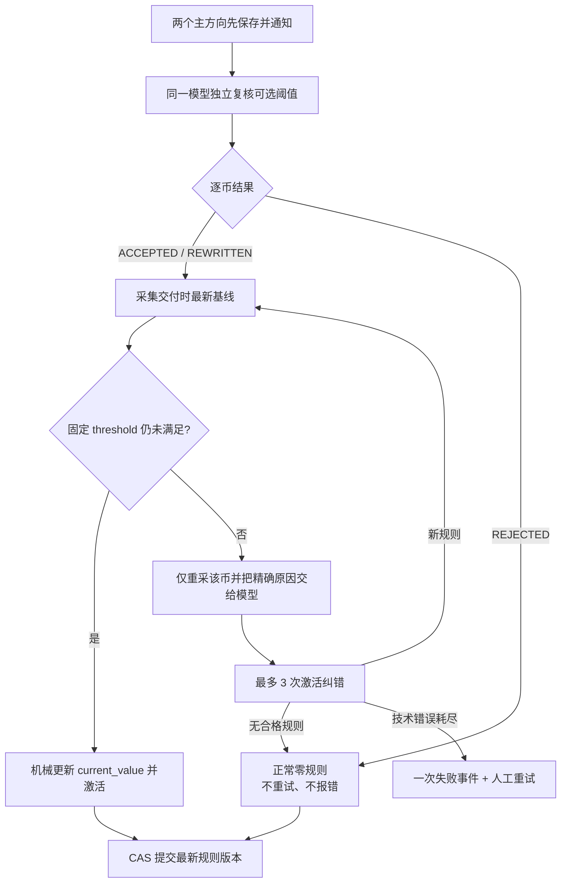

# 阈值复核与激活纠错设计

日期：2026-08-19

状态：已按用户最新确认更新并实现

适用版本：`signal-analysis-v9` / `ultrashort-v5`

## 1. 目标与优先级

系统第一优先级是默认模型给出两个相对最值得参考的方向。实时阈值只是方向结论之后的可选辅助工具，不得反向阻塞、改写或清空主方向。

- 独立 review 返回 `ACCEPTED/REWRITTEN`：激活 1–3 条规则。
- 独立 review 返回 `REJECTED`：表示本轮没有高质量阈值，是正常的零规则结果；不进行语义重试、不创建 failure event、不发 Telegram 异常。
- JSON/Schema、证据 ID、同向触发、生成时已经满足等技术/执行错误：使用有限技术重试。
- 模型审核后、正式激活前，若最新完成柱已经越线或规则不可执行：重采该币并最多静默重审 3 次；模型可返回新规则，也可正常返回无规则。

## 2. 处理流程

## 3. 阈值质量合同

- 每个主信号按需 0–3 条；没有规则不是异常。
- primary 必须是反方向已完成 1m/5m/15m/30m/1h 价格结构；微观指标只能作为可选组合确认。
- 优先选择最近、真实、尚未满足且脱离普通噪声的反向 pivot、区间边界或重新接受位。
- 正式失效结构价只有在更快完成柱能提供实际提前复核窗口时才使用；如果 crossing 与正式失效几乎同时，宁可零规则。
- 阈值可等于正式失效价，但不得越过正式失效价才报警；crossing 只请求复核，不自动宣布方向失效。
- 宿主不使用隐藏 ATR/距离门槛改写阈值。宿主机械校正同批证据的 `current_value`、距离元数据和 1800–3600 秒有效期；结构化执行字段优先于自然语言措辞。

## 4. 错误与通知

以下是正常状态，不发送失败通知：

- 模型明确 `REJECTED`；
- 激活纠错后模型认为没有新的高质量阈值；
- 某一个或两个主信号本轮为零规则。

以下才是异常：

- 模型输出无法解析或违反 Schema；
- 使用同方向条件、目标价、未知证据或生成时已经满足的条件；
- 采集、存储、版本 CAS、认证、额度或模型不可用；
- 激活纠错的真正技术错误耗尽。

异常通知必须包含工作流、失败步骤、已完成前置、直接原因、因果、影响和解决方式。额度/认证/模型不可用立即停止，不空耗策略纠错次数。

## 5. 并发与版本

- 两个方向通知不等待阈值 review。
- 旧规则持续有效到 `:00/:30` 定时任务真正开始；不再提前 5 分钟冻结。
- 阈值 crossing 原子消费旧规则；随后重采、紧急分析并生成新版本。旧规则绝不复活。
- 定时与紧急流程各自运行，通过 analysis ID 与 CAS 防止迟到结果覆盖新版本。

## 6. 验收场景

1. 两币均有规则：一次 review 后激活，无异常。
2. 一币有规则、一币 `REJECTED`：整体 READY，只激活一币，无失败通知。
3. 两币均 `REJECTED`：整体 READY，提交零规则版本，无失败通知。
4. 激活前普通基线向任一侧移动但条件未满足：机械重基线，不调用模型。
5. 激活前条件已经越线：仅重采/重审该币；得到新规则则激活，得到 `REJECTED` 则正常零规则。
6. 激活纠错技术错误连续耗尽：只产生一次最终失败事件。
7. 额度/认证错误：立即停止并给出精确原因。
8. HEMI 回放：旧规则持续到自然边界；15:25 完成柱不再落入监测盲区。

本设计不宣称方向预测胜率；实际方向误差必须用后续行情另行结算。
