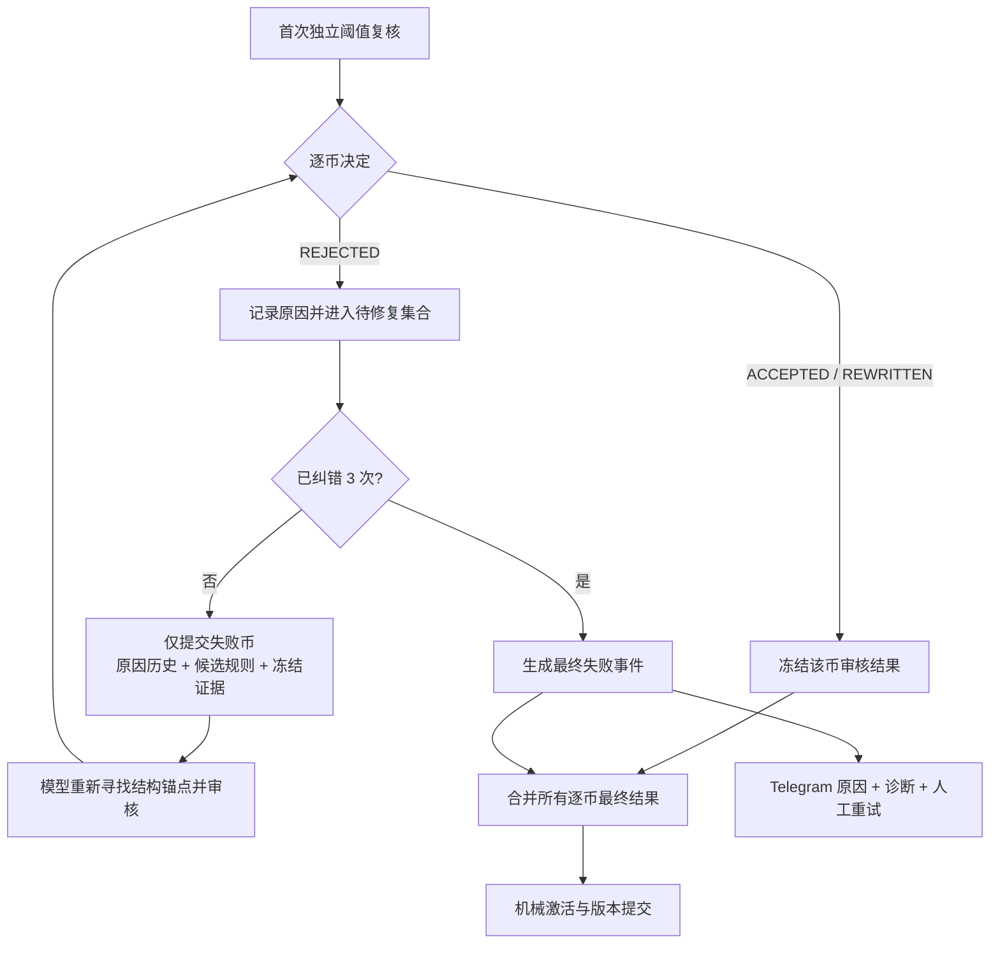

# 阈值复核按币静默自动纠错设计

日期：2026-08-19

状态：待用户书面确认

适用版本：`signal-analysis-v7` / `ultrashort-v5` 之后

## 1. 目标

当独立阈值复核对某个主信号返回 `REJECTED` 时，系统不立即发送 Telegram 失败通知，而是把该币的拒绝原因、上一版候选规则和同一轮冻结证据重新交给默认模型，最多自动纠错三次。任何一次产生合格规则即停止该币纠错；三次仍失败才发送现有的完整原因、诊断链和人工重试按钮。

目标是提高首次或内部纠错后的可用率，不是强迫模型必须生成阈值。没有真实中间结构锚点时，最终 `REJECTED` 仍是正确结果。

## 2. 计数与范围

- 首次阈值复核不计入自动纠错次数。
- 首次复核后最多再进行 3 次纠错，因此单个币最多经历 4 次模型审核。
- 每轮只提交仍为 `REJECTED` 的币；已经 `ACCEPTED` 或 `REWRITTEN` 的币立即冻结，不重新分析、不改写。
- 多个币同时被拒绝时，可把当前仍失败的币组成一个待修复批次调用模型；每个币独立记录纠错次数、原因历史和最终决定。
- 本设计只处理模型能够修复的阈值语义/结构问题。采集、存储、认证、额度、模型不可用等问题不伪装成策略纠错。

## 3. 处理流程

纠错使用该次阈值复核已经冻结的证据，避免同一纠错序列因行情移动而比较不同基线。正式激活仍重新采集交付时基线；如果完成 K 线已经变化，现有激活基线保护继续拒绝该币规则，不静默换值。

## 4. 模型反馈合同

每次纠错输入按币包含：

- 当前方向与正式完成柱失效条件；
- 上一版候选阈值及完整可执行条件；
- 上一次 `REJECTED.rationale`；
- 更早纠错轮次的精简原因历史；
- 同一轮冻结证据与 `monitoring_observable_baselines`；
- 剩余纠错次数。

模型必须针对原因重新分析，而不是机械移动数值：

1. 重新检查“完成柱基线 → 阈值”和“阈值 → 正式失效位”两段距离；
2. 优先寻找已确认 5m/15m 反向枢轴或由完成价格柱确认的可靠结构；
3. 若使用 1m 枢轴，必须有非噪声距离和反向价格组合确认；
4. 连续完成柱或 confirmations 的等待不能使正式失效先发生；
5. 找不到可执行结构时继续返回 `REJECTED`，不得为通过审核编造阈值。

首次候选 Prompt 同步增加同一套“双边距离 + 结构锚点 + 完整确认时延”自检，减少进入纠错的概率。Schema、枚举、证据 ID 和现有输出字段保持不变。

## 5. 错误与通知语义

以下情况进入静默自动纠错：

- 模型对某币明确返回 `REJECTED`；
- 该币规则被模型/宿主合同校验判为可通过重新生成修复的语义或结构输出错误。

以下情况不消耗三次策略纠错预算，并按现有失败边界处理：

- `CODEX_AUTH_REQUIRED`、`CODEX_CREDITS_EXHAUSTED`、`CODEX_MODEL_UNAVAILABLE`；
- 监测复核证据采集失败；
- SQLite、版本 CAS 或 Telegram 投递失败；
- 其它模型无法通过修改阈值解决的基础设施异常。

三次纠错期间不创建用户可见 failure event、不发送 Telegram、不暴露中间失败。预算耗尽后只为最终仍失败的币建立一次失败事件；已通过币不产生失败通知。最终通知继续保留直接原因、完整因果链、实际影响、解决方式、完整诊断和 `RERUN_MONITORING` 按钮。

## 6. 状态与诊断

阈值复核诊断新增逐币字段：

- `initial_decision`；
- `repair_attempts`（0–3）；
- `repair_history`（轮次、决定、精简原因、延迟）；
- `final_decision`；
- `exhausted`。

全局 `attempts` 继续表示实际模型调用次数，技术/Schema 尝试与策略纠错次数分别记录，避免把模型进程重试误认为阈值重写。日志只记录内部纠错摘要，不在中间轮发送 Telegram。

## 7. 并发与版本安全

- 纠错仍属于原 scheduled/emergency analysis 的后置监测阶段，不阻塞已经发送的方向通知。
- 最新 scheduled 版本权威性不变；纠错完成时由现有 CAS 检查是否已被更新分析取代。
- `:25/:55` 冻结和 `:30/:00` 定时流程不等待旧版本纠错。
- 迟到的纠错结果不得覆盖更新的 scheduled 或 emergency 监测版本。
- 首次通过的币和后续修复通过的币在同一次最终提交中合并，避免部分结果被重复发布。

## 8. 验收与场景测试

自动化必须覆盖：

1. 两币首次均通过：只调用模型一次，无纠错、无失败通知。
2. A 首次通过、B 第二次通过：只重试 B；A 的规则保持逐字段不变；无失败通知。
3. A/B 首次均拒绝，A 第一次纠错通过、B 第三次通过：待修复集合逐轮缩小，最终 READY，无失败通知。
4. 某币连续三次纠错仍拒绝：总计首次加三次审核，只生成一次最终失败事件和一个人工重试入口。
5. 一个币耗尽、另一个币通过：主方向信号保留，监测结果为 PARTIAL，只通知耗尽币。
6. 额度/认证错误：立即停止，不空耗三次策略纠错。
7. 纠错输出 Schema/证据 ID/方向语义错误：按可修复合同错误处理，但总调用受明确预算约束，不形成无限循环。
8. 纠错期间产生更新 scheduled 版本：旧结果被 CAS 判为 SUPERSEDED，不发布旧阈值。
9. 真实灰盒重放 TRIA/HEMI：拒绝原因确实回传；模型可以给出有新结构依据的规则或在三次后安全拒绝，中间不发送 Telegram。
10. 正常入口运行完整 Top5 → Top2 → 主通知 → 阈值审核/纠错 → 激活流程，确认两个方向通知不等待、不重复。

## 9. 不在本次范围

- 不改变 Top5、Top2、方向判断和四项 K 线预测；
- 不改变大致止盈位、正式方向失效或阈值 crossing 生命周期；
- 不让宿主计算、移动或替换模型阈值；
- 不自动重试公开数据采集、数据库、Telegram、额度或认证故障；
- 不为了消除失败通知而降低阈值质量门槛。

## 10. 完成标准

实现完成需同时满足：按币最多三次静默纠错、已通过结果不漂移、最终失败才通知、不可修复错误不浪费预算、首次 Prompt 自检加强、全量自动化通过，以及至少一次隔离的完整日常流程验证。生产部署后只观察自然结果，不人为降低阈值制造“通过”。
