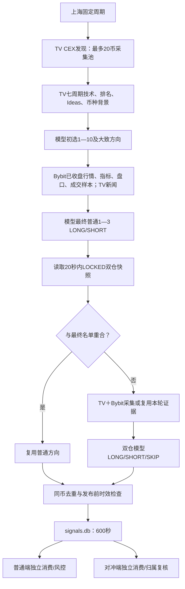

# 需求、当前实现与复审（2026-09-26）

本报告以用户最新 AGENTS.md 和本次会话为准。旧参考规格的 Binance、30—60分钟、故障重试等要求不适用。审核包括分析系统全部活动源码、两交易端全部活动源码、当前提示词、部署与配置、对应测试及真实历史轮次。测试采用隔离数据库与模拟交易所；真实运行核查使用现有服务和账本。

## 最终需求与实现

| 要求 | 当前实现与边界 |
|---|---|
| 上海固定周期 | 默认20分钟；现场保存60分钟。允许10—1440且整十，以1970-01-01上海00:00连续计算；暂停不打断当前轮，恢复/保存采用下一固定时间，重启/长轮错过不补跑。 |
| TradingView发现 | CEX全量BYBIT USDT永续交集；Bybit instruments只验证可交易身份。按活跃度、涨跌两端、量变化及技术评级压缩到最多20币，再采集逐币证据。模型没有阅读所有合约的完整证据。 |
| 两阶段普通方向 | TV模型比较全部有效采集池，初选1—10及初判；对这些币补Bybit证据，最终模型比较全部有效候选，输出1—3个LONG/SHORT。正常输入非空、低置信如实；故障显式失败。 |
| 时间目标 | 未来1—2小时；15m/30m/1h近期已收盘Bybit结构优先，2h与周背景辅助；TV未确认收盘快照不得冒充已收盘行情。 |
| 双仓 | 普通最终之后读取20秒内、LOCKED、双向且归属明确的仓位。最终名单重合直接复用；其他双仓另行分析，可SKIP，不占普通名额。普通初选但未最终入选的双仓可复用采集证据，再执行其唯一双仓方向判定。 |
| 发布与消费 | 每轮每币唯一发布；共享signals.db，发布起600秒有效；两端只读、独立持久认领和风控，旧ID不重放。有效方向不保证交易端一定开仓。 |
| 系统边界 | 分析端没有交易密钥/下单接口；模型仅隔离子进程调用。交易端没有选币与模型服务。分析Bot独立；详情固定原轮次；底部只管理菜单。 |
| 扩展/登录 | name/stage/collect适配器；公开未登录数据。核心身份/行情失败排除，可选背景不可用保留缺失；当前未加入需用户登录的数据源。 |

## TradingView实际进入模型的内容

- 七周期：5m、15m、30m、1h、2h、4h、1d的时间、OHLCV、综合/均线/振荡评级、RSI及前值、ADX/DI、MACD双线、EMA20/50、SMA50、ATR、布林上下轨、VWMA；缺失字段及未确认收盘状态同步传入。
- 本合约成交与变动、可用周/月表现、波动率、相对量、持仓量/资金费率等背景；CEX排名与母体数量。
- Ideas前2条标题/摘要/时间/方向标签/是否同Bybit合约；Coins聚合背景；最终阶段新闻前3条标题/时间/来源；配置的扩展字段。
- 原始采集还有额外均线、振荡器和Pivot，当前压缩白名单不全部传入模型。完整原始采集与真正的模型输入分别留存，不能将“抓到”说成“模型用到了”。
- 已有真实事件TV_SELECTION_EVIDENCE、FINAL_SELECTION_EVIDENCE证明两阶段收到TV数据。理由偏向Bybit不能证明TV未使用，也不能量化模型内部权重。

## 本次确认并修复

| 问题 | 影响 | 修复与验证 |
|---|---|---|
| 双仓证据仅在模型前验时效 | 模型返回时证据可能已超过600秒，却获新TTL | 模型后发布前再次校验；假时钟覆盖590+11秒、超长模型及正常模型，不二次调用。 |
| 仓位快照借用监控完成心跳 | 中间API耗时可把旧仓位误判为20秒内 | 独立exchange_positions_observed_at与positions同事务保存，以请求开始时间保守计龄；无时间/过期/未来均拒绝。心跳不刷新行情年龄。 |
| 一个坏发布阻断整个消费者轮询 | 后续好信号可能等到过期 | 两端逐条解析隔离，本地持久拒绝、一次告警；共享库仍只读；执行异常继续原认领恢复路径。 |
| 重复REST盘口被判故障 | 完全相同ts/seq/u快照可能排除有效币 | 允许一致重复且标独立样本数；倒退/同ID内容冲突仍拒绝。MSFU公共API复现；历史TMX缺原始失败快照，不能断言其具体类型。 |
| 模型输出无效后走双仓再分析 | 可能对同轮已涉及币再判向 | 请求开始后的服务/JSON/Schema/越界输出错误统一停止本轮后续模型；采集阶段无数据仍能单独分析可用双仓。 |
| 可选源网络异常升级为核心失败 | Coin背景连接失败导致整币排除 | 可选适配器捕获httpx传输异常并保留unavailable；核心来源失败规则不变。 |
| 未入新池就标旧事故已恢复 | 未验证的数据源看起来恢复正常 | 仅实际采集成功解决该币事故；不在池中不会伪称恢复。 |
| 展示初判置信度而缺最终置信度 | 初判LOW、最终MEDIUM容易混淆 | 保存并显示最终置信度；历史详情只读原轮结果补显，不重新发布。 |
| 旧扫描入口和话术残留 | 维护误判/按钮承诺错误 | 根旧BINANCE脚本移到外部归档；孤立字节码清理；删除分析端死重试方法，保留Bot去重表；交易Bot“扫描/重新筛选”文案更新。 |

## 尚值得优化

1. **方向可解释性**：模型结果目前为自由文本理由，可增加结构化证据引用、TV与Bybit一致/冲突、改判依据、主要反证、1—2h失效条件。需要提示词版本与真实验证，不能直接改变Schema破坏消费端。
2. **采集时延与信息收益**：当前每币多请求、串行池较慢；可评估有界批量/并行及字段裁剪。不能把更多字段直接视为更高准确率，也不应为加速绕过访问限制。
3. **Ideas/News质量**：优先较新、明确同资产/同合约的材料，加入内容身份与日期固定样本测试；倍数合约/同名资产需要更可靠Coins映射。当前全部标弱背景。
4. **证据归档**：现场analysis.db约176MiB；最近每轮带cycle_id证据约9—11MB，还不含独立模型输入。可压缩原始证据、保留hash和索引，规划保留期；本次没有删除历史证据。
5. **Bot限流一致性（本次已修）**：对冲Bot与分析Bot已加入持久retry_after冷却，等待期间不消耗通知预算，重启仍遵守冷却。回归覆盖正常/缺失/非法retry_after。
6. **死兼容代码**：两端market.py/Candle及risk.reachable_tp只供兼容测试，无生产扫描调用；分析公共客户端亦有未用扩展方法。可单独裁剪并归档对应测试。本次明确列出，未将“无旧扫描调用”夸称成“完全没有历史兼容函数”。
7. **模型质量验证**：以1h/2h实际后续收益、最大不利波动、交易成本、置信度分层做离线留出评估；不自动调策略、不承诺盈利，不以短期少量结果证明准确率。

## 边界

TradingView公开网页内部端点并非稳定公共行情API，403/页面变动仍会带来单币失败。Bybit REST快照不是连续订单流；Ideas/新闻是弱背景。测试通过代表约束与回归通过，不代表模型方向必然正确。当前发现的优化项明确保留，没有声称系统不存在任何可能问题。

## 模型讨论记录

通过现有隔离ModelService调用gpt-6-sol/medium，对14:00轮真实历史输入与输出完成两轮复盘，均不发布信号。原始答复见direction-review-round1.json与direction-review-round2.json。

第一轮确认：TV参与候选来源与初判，但最终理由主要写Bybit；建议明确确认/削弱/改判链、核心周期、反证与不完整微观样本。第二轮收敛：保持原Schema，只说明入选币相对排序；删除未入选币强制理由、逐币未来条件和交易TTL等会挤占理由的要求；普通与双仓SKIP规则分开。

新版候选提示为direction_selection_v2.md、direction_v16.md；初选tv_selection_v1.md不改。真实历史回放只验证Schema、币种约束和表达是否落实，不代表准确率提高，也不向共享signals.db写入。真实验证结果与是否切换见本报告最终验证记录。

盘口语义参考：[Bybit Orderbook官方文档](https://bybit-exchange.github.io/docs/v5/market/orderbook)。TradingView页面范围和技术评级来源见此前ROOT-CAUSE-20260926.md所引官方文档。

## 最终验证与版本

- 两轮真实模型讨论后，direction_selection_v2.md与direction_v16.md分别完成一次真实模型历史证据验证；严格Schema与候选身份均通过，结果见direction-v2-validation.json。普通验证ARK/RARE/ZEC、双仓MUBARAK的理由明确包含TV线索、Bybit结构与最强反证。这些是14:00历史数据离线回放，不是当前建议，published=false。
- 生产profile切换为v2/v16；v1/v15文件保留以供版本比较，初选tv_selection_v1不变。模型ID和推理等级不变。
- 分析端Ruff/mypy通过（21源文件），pytest 221 passed；普通端Ruff/mypy通过（22源文件）、pytest 200 passed；对冲端Ruff/mypy通过（23源文件）、pytest 232 passed。
- 消费者坏发布隔离、独立快照时间、模型后时效、模型输出故障中止、可选源网络降级、盘口重复与冲突、限流跨重启均有针对性回归。
- 本次未执行真实交易测试订单，未改交易参数/已有仓位/历史账本。现有15:00自动周期由原进程继续完成；服务切换后的证据在LIVE-STATUS.md记录。
